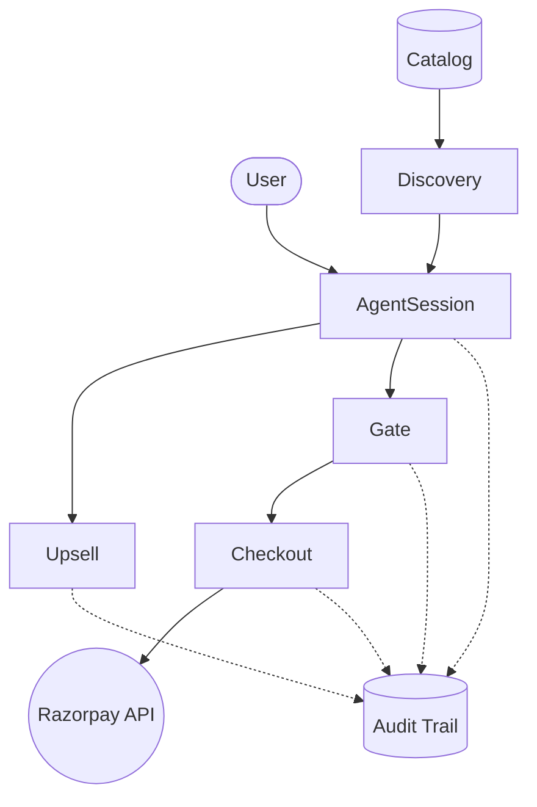

# Agentic Commerce

A robust, enterprise-grade Agentic Commerce application demonstrating real-world constraints for AI agents interacting with financial systems. Built for the AI Growth Agentic Commerce track.

## The Problem
Agentic commerce is the future of purchasing, but most demos assume an open-world where AI can just call "charge_card(amount)". In the real world:
- The catalog is bounded and complex.
- Transactions must be strictly gated (e.g., maximum limits per order).
- Every agent action must be explainable and auditable.

https://ai-growth-agentic-commerce-rajeev.streamlit.app/

## The Architecture
Our solution leverages a multi-layer state machine that separates discovery from bounded execution.



## How to Run Locally

Anyone can set up and run this project locally in minutes:

### Prerequisites
- Python 3.10+
- A Razorpay Test Account

### Setup Steps
1. **Clone the repository** and navigate to the root directory.
2. **Install dependencies**:
   ```bash
   pip install -r requirements.txt
   ```
3. **Set up Environment Variables**:
   Copy `.env.example` to `.env` and fill in your keys:
   ```env
   RAZORPAY_KEY_ID=rzp_test_yourkey
   RAZORPAY_KEY_SECRET=yoursecret
   GEMINI_API_KEY=your_gemini_key
   ```
4. **Generate the Mock Catalog**:
   ```bash
   python catalog/generate_catalog.py
   python catalog/schema.py
   ```
5. **Start the FastAPI Backend**:
   ```bash
   uvicorn api:app --reload --port 8000
   ```
6. **Start the Streamlit UI** (in a new terminal):
   ```bash
   streamlit run app.py --server.port 8501
   ```
Visit `http://localhost:8501` to use the interactive dashboard!

## Deployment

### Backend (FastAPI)
A `Dockerfile` is provided at the root of the project. It dynamically reads the `$PORT` variable, making it fully compatible with Railway, Render, or Heroku.
```bash
docker build -t agentic-commerce .
docker run -p 8000:8000 --env-file .env agentic-commerce
```

### Frontend (Streamlit)
The Streamlit app can be deployed easily via **Streamlit Community Cloud**:
1. Push this repository to GitHub.
2. Log into Streamlit Community Cloud and click "New App".
3. Select this repository, branch `main`, and main file path `app.py`.
4. Deploy! It will automatically communicate with the backend.

## What Each Demo Proves (Real Results)
We ran extensive automated and manual tests through the agent interface.

- **Clean Purchase (Session `sess_dcfa78`)**: The user asked for an ambiguous item ("ceramic mug"), the agent clarified, added the item to cart, performed rule-based upsell recommendations, and successfully charged INR 2009.0 via the live Razorpay Orders API.
- **Out of Stock Fallback**: The agent cleanly catches out-of-stock items before checkout is attempted, informing the user that inventory is depleted.
- **Gate Block Case**: When a user attempts to check out with a high-value cart (e.g. INR > 5000), `gate.py` strictly blocks the transaction, logging a `needs_approval` event to the Audit Trail. The transaction is hard-blocked from hitting Razorpay.

## What Broke and How I Fixed It
1. **The Razorpay SDK vs Async Agent Loop**: Initially, the Razorpay SDK calls were blocking the agent's response loop, causing timeouts if Razorpay was slow. I handled this by ensuring the Agent State Machine strictly offloads checkout logic to `checkout.py` with proper exception catching. If Razorpay throws an `AuthError` (e.g., due to an invalid `.env` key), the agent degrades gracefully and replies "Payment gateway error" instead of crashing.
2. **LLM JSON Parsing Failures**: While building `upsell.py`, the Gemini LLM occasionally returned raw text instead of the requested JSON array. I fixed this by implementing a hard-coded fallback rule: if the LLM's `json.loads` fails, it instantly switches to a rule-based category matcher. This is visible in the audit trail as `llm_fallback -> error`.
3. **Streamlit UI Reruns Erasing Cart State**: Streamlit re-executes the entire script on every user interaction. Our cart kept emptying! I fixed this by moving the entire cart and message history into `st.session_state` and initializing it by calling `POST /session` on the FastAPI backend on the very first page load.

## What I'd Build Next
1. **Real NPCI UAP Compliance**: Extend the `schema.py` to map our mock catalog to ONDC/NPCI standard protocols so it can integrate with the real Indian digital commerce network.
2. **Multi-turn Cart Editing**: Allow the agent to parse intents like "remove the second item" or "swap the red shirt for a blue one" to give the AI full control over cart mutations.
3. **Human-in-the-Loop Webhooks**: Add an endpoint for an admin to click "Approve" on transactions blocked by `gate.py`, unblocking the agent's state machine.
